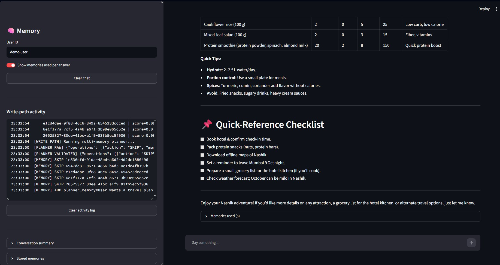
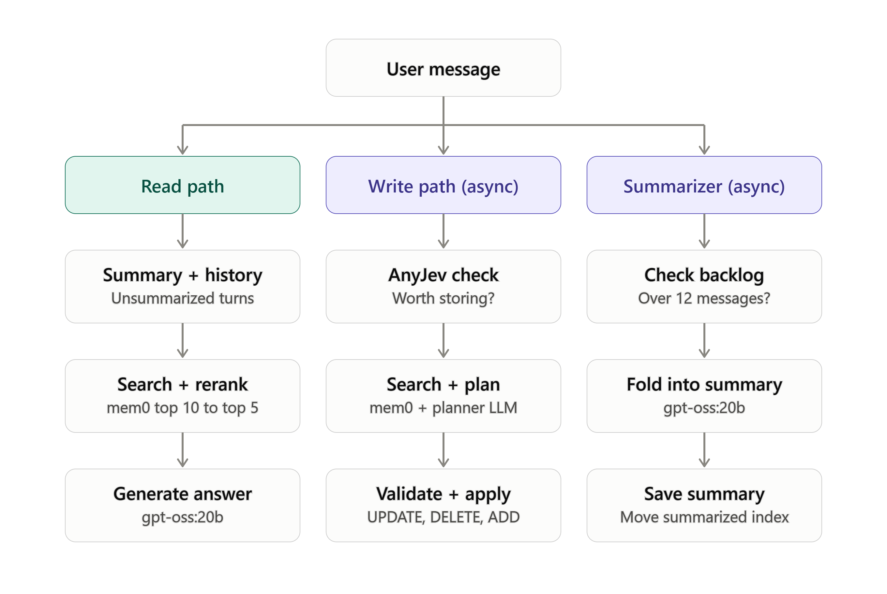

# 🧠 Agentic Memory Assistant

A Streamlit chat assistant with **long-term memory** that stays out of the way of the conversation. Answers are generated using relevant memories about the user, while new facts are saved **in the background** so the chat never waits on memory writes.



## Features

- **Long-term memory with [mem0](https://mem0.ai)**: facts, preferences, and plans persist across sessions.
- **Reranked retrieval**: mem0 returns the top 10 candidates, a cross-encoder reranker narrows them to the top 5.
- **Selective writing**: [AnyJev](https://github.com/nokia-applied-research/AnyJev), an open-source library created by Nokia and inspired by JEV, runs a System One model to decide which conversations are worth storing in mem0, so small talk and general questions are skipped.
- **Memory planner**: an LLM compares the new message against existing memories and chooses `UPDATE`, `DELETE`, `SKIP`, or `ADD`, so stale or conflicting facts don't pile up.
- **Validated writes**: planner output is checked before it touches mem0. It can only modify memories that were actually retrieved as candidates, and `ADD` stores the user's original message rather than LLM-generated text.
- **Rolling conversation summary**: older turns are folded into a summary in the background, while the most recent messages stay verbatim.
- **Live activity log**: the sidebar shows exactly what the write path and summarizer are doing.
- **Memory transparency**: each answer can show which memories were used, with mem0 and rerank scores.

## Architecture

Every user message fans out into three independent paths. Only the **read path** blocks the response. The write path and summarizer run in background threads.



| Path | Runs | What it does |
|------|------|--------------|
| **Read path** | Synchronous | Gets the summary and unsummarized history, searches mem0 (top 10), reranks (top 5), generates the answer with `gpt-oss:20b`. |
| **Write path** | Background thread | AnyJev decides if the message is worth storing, mem0 search finds candidates, the planner LLM decides actions, the plan is validated and applied (`UPDATE` / `DELETE` / `ADD`). |
| **Summarizer** | Background thread | When more than 12 messages are unsummarized, older ones are folded into the summary and the summarized index advances. The last 6 messages stay verbatim. |

### Source priority

When sources disagree, the assistant follows this order:

```
current user message > recent messages > conversation summary > long-term memories
```

## Models and services

| Role | Model / service | Where it runs |
|------|-----------------|---------------|
| Answer generation | `gpt-oss:20b` | Ollama cloud (`https://ollama.com`) |
| Memory planner | `gpt-oss:20b` | Ollama cloud |
| Conversation summarizer | `gpt-oss:20b` | Ollama cloud |
| Store / skip decision (System One model) | `Qwen/Qwen3.5-4B` via AnyJev (open-source, by Nokia) | Local (Hugging Face) |
| Reranker | `Qwen/Qwen3-Reranker-0.6B` | Local (Hugging Face, CUDA if available) |
| Memory store | mem0 Platform | mem0 cloud |

The two Hugging Face models are downloaded on first run. A GPU is recommended but not required.

## AnyJev and the System One model

Deciding whether a message deserves to be remembered happens on every turn, so it needs to be fast and cheap. Instead of asking the large LLM, the write path uses **AnyJev** with `Qwen/Qwen3.5-4B` (run locally) as **System One** model.

**AnyJev** is an open-source library created by Nokia. It is inspired by JEV but is not an exact implementation of it. Here it is used as a fast System One model that decides which conversations get stored in mem0.

- The decision is framed as a single yes/no question (`SHOULD_STORE_QUESTION` in `app.py`): does this turn contain user-specific information that would be useful in future conversations?
- AnyJev returns the probability that the answer is "yes" (`p_true`).
- If `p_true >= STORE_THRESHOLD` (default `0.5`), the message continues to the memory planner. Otherwise the write path stops immediately.

This keeps the heavy planner LLM, and the mem0 search that feeds it, from running on messages that carry nothing worth storing.

## Prerequisites

- Python **3.11**
- [uv](https://docs.astral.sh/uv/) (or pip)
- **A mem0 API key**
- **An Ollama API key**
- (Optional) NVIDIA GPU with CUDA for the local models

## Get your API keys

You need accounts and API keys for both services. The app will not start without them.

### 1. Ollama API key

1. Sign in or sign up at [ollama.com](https://ollama.com).
2. Open your account's **API keys** settings page and create a new key.
3. Copy it. This becomes `OLLAMA_API_KEY`.

The app calls Ollama's hosted API at `https://ollama.com` with this key as a bearer token, so you do not need to run Ollama locally.

### 2. mem0 API key

1. Sign in or sign up at [app.mem0.ai](https://app.mem0.ai).
2. Open the dashboard's **API Keys** section and create a key.
3. Copy it. This becomes `MEM0_API_KEY`.

### 3. Create your `.env`
 
The repo includes a `.env.example` template:
 
```dotenv
OLLAMA_API_KEY=<OLLAMA_API_KEY>
MEM0_API_KEY=<MEM0_API_KEY>
```
 
Copy it to `.env` and replace the placeholders with your real keys:
 
```bash
# macOS / Linux
cp .env.example .env
 
# Windows (PowerShell)
Copy-Item .env.example .env
```
 
> ⚠️ Never commit `.env`. Make sure it is listed in `.gitignore`.

## Run locally

```bash
# install dependencies
uv sync

# start the app
uv run streamlit run app.py
```

Open http://localhost:8501.

The first start takes a while because the Qwen models are downloaded from Hugging Face. Model loading is cached with `st.cache_resource`, so later reruns are fast.

## Run with Docker

The image uses a multi-stage build and NVIDIA's CUDA base image.

```bash
docker build -t agentic-memory .

docker run --gpus all -p 8501:8501 \
  -v hf_cache:/models/hf \
  --env-file .env \
  agentic-memory
```

- `--gpus all` requires the NVIDIA Container Toolkit (or Docker Desktop with WSL2 GPU support on Windows). Remove it to run the models on CPU.
- `-v hf_cache:/models/hf` persists downloaded models (`HF_HOME` points here), so they are not re-downloaded on every container start.
- `--env-file .env` passes your API keys into the container. The keys are not baked into the image.

The Docker image is large (roughly 10 GB) because PyTorch bundles its CUDA libraries. On Docker Desktop for Windows, give the WSL2 VM enough memory (about 12 GB) and keep 40 GB or more of disk free when building.

## Usage

1. Open the app and keep the default **User ID** (`demo-user`) or enter your own. Memories are scoped per user ID.
2. Chat normally. Tell it things about yourself, such as preferences, plans, or setup details.
3. Watch the **Write-path activity** panel in the sidebar to see what was stored, updated, or skipped.
4. Expand **Stored memories** to inspect what mem0 currently holds.
5. Expand **Memories used** under an answer to see which memories shaped it.
6. Use **Clear chat** to reset the conversation and summary. This does not delete mem0 memories.

## Configuration

Tunable constants are at the top of `app.py`:

| Constant | Default | Meaning |
|----------|---------|---------|
| `MEMORY_LIMIT` | `10` | Candidates fetched from mem0 on the read path |
| `MEMORY_READ_TOP_K` | `5` | Memories kept after reranking |
| `MEMORY_WRITE_TOP_K` | `10` | Candidates the planner compares against on writes |
| `STORE_THRESHOLD` | `0.5` | Minimum AnyJev probability required to attempt a write |
| `HISTORY_RECENT_MESSAGES` | `6` | Most recent messages kept verbatim (3 exchanges) |
| `SUMMARY_TRIGGER_MESSAGES` | `12` | Unsummarized backlog size that triggers summarization |
| `MAIN_MODEL` / `MEMORY_REASONING_MODEL` / `SUMMARY_MODEL` | `gpt-oss:20b` | Ollama models for each role |
| `ANYJEV_MODEL` | `Qwen/Qwen3.5-4B` | Local System One model used by AnyJev for the store/skip decision |
| `RERANKER_MODEL` | `Qwen/Qwen3-Reranker-0.6B` | Local cross-encoder |

## Project structure

```
.
├── app.py              # Streamlit app: read path, write path, summarizer
├── pyproject.toml      # Dependencies (requires-python >=3.11,<3.12)
├── uv.lock
├── Dockerfile
├── .dockerignore
├── .env.example        # Template for the required API keys
├── .env                # Your real API keys (not committed)
└── img/
    ├── core_components_flow.png
    └── agentic_mem_streamlit.jpg
```

## Design notes

- **Memory never breaks chat.** Write-path, planner, and summarizer errors are caught and logged. The assistant still answers.
- **Local models are serialized.** A lock guards the reranker and AnyJev so the background write thread and the foreground read path don't use them at the same time.
- **Background threads never touch Streamlit state.** They receive snapshots of the data and report through a thread-safe activity log.
- **The planner can't invent facts.** It only chooses operations over existing candidates. New memories are stored from the user's original message.
- **Similarity is not truth.** The planner prompt treats retrieval ranking as no evidence that a memory is current or correct. The newest explicit user statement wins for state-like attributes.
